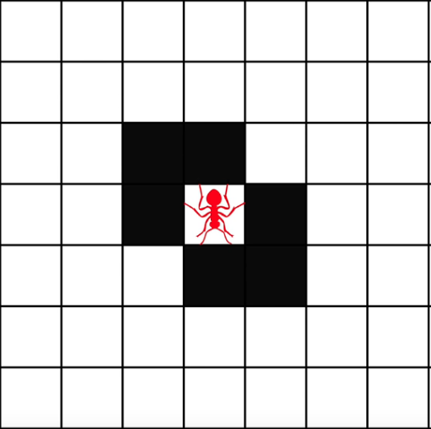

# Exercice 1 - La fourmi de langton, v1 : 8 étapes, grille de 8 x 8 (centrée en 3,3), cases de 25 pixels de côtés, une étape dure 0.5s, fourmi initialement tête en haut

Commençons par une petite "séance cinoche" :

https://www.youtube.com/watch?v=qZRYGxF6D3w

Le challenge consiste à reproduire les animations de David Louapre (le vidéaste de la chaîne "science étonnante" que vous venez de voir dans la vidéo).

Dans ce premier exercice, on va s'attaquer à la toute première animation (sans dessiner la fourmi, bien sûr !) : https://youtu.be/qZRYGxF6D3w?t=73 ([Télécharger](https://github.com/pworontzoff/playground-AnimPaper-Ant-Enonces/blob/master/markdowns/videos/animEx1.mp4?raw=true))

Pour cela, nous allons coder les règles de déplacements de la fourmi :
- si la case sous la fourmi est blanche, elle repeint cette case en noir, puis elle tourne d'1/4 de tour à droite, puis elle avance d'une case ;
- si la case sous la fourmi est noire, elle repeint cette case en blanc, puis elle tourne d'1/4 de tour à gauche, puis elle avance d'une case.

Pour cet exercice, on se limite à 8 étapes (8 répétitions), afin d'obtenir ce résultat (sans la fourmi) :

## Quelques remarques

Notez que dans le titre "Exercice 1 - ..." figurent des indications à respecter pour une animation fluide et claire.

On pourrait croire que cet exercice est le plus facile car le résultat n'est pas très impressionant, mais c'est le contraire, une fois cet exercice bien réussi, les autres (fourmi v2, v3, v4 et v5) ne sont plus que quelques ajustements à faire !

La difficulté de l'exercice n'est pas tant dans l'implémentation des règles simples énoncées plus haut, mais il va surtout falloir trouver un moyen de "se mettre dans la peau de la fourmi" et donc essayer de :
- trouver une manière d'indiquer et de mémoriser la direction vers laquelle la fourmi regarde (vers le haut, la gauche, la droite ou vers le bas) ;
- d'écrire une fonction par déplacement possible de la fourmi :
    * une qui fait tourner la fourmi d'1/4 de tour vers la droite puis avancer d'une case ;
    * l'autre qui fait tourner la fourmi d'1/4 de tour vers la gauche puis avancer d'une case.
    
Bon travail !

@[Exercice 1]({"stubs": ["main.c"],"command": "sh /project/target/run.sh", "project" : "exercices"})
